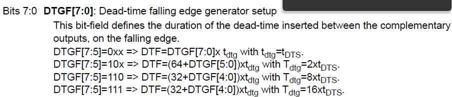

# 2425_ESE3745_LAKHMECHE_JERJOUB
Encadrant : Mr.Martin
# Compte Rendu : Contrôle de MCC avec la Carte Nucleo-G474R


Ce TP est constitué de 3 séances dont l'objectif est la commande et l'asservissement d'une MCC grâce à un prototype de l'ENSEA basé sur le STM32. 

Le projet STM32cubeIDE est situé dans le dossier *'NUCLEO-G474RET6-Inverter_Pinout'* sur ce repository github.
### 📚   [Accédez au Doxygen ici.✨](./Doxygen)

## 6. TP n°1 - Commande MCC basique

## 6.1 Génération de 4 PWM

On génère quatre PWM sur les bras de pont U et V afin de contrôler le hacheur à partir du timer 1 qui est déjà attrribué sur les pins.

D'après le cahier des charges (cdc), la fréquence de la PWM est de 20 kHz ce qui ne devrait pas être audible. Les temps mort minimum sont détaillés dans la suite. Et la résolution est de 10 bits. Pour les tests, on fixe le rapport cyclique à 60%.

Une fois les PWM générées, on les affichent sur un oscilloscope à l'onde d'une sonde numérique pour visualiser les PWM configurées :

| marron | orange | noir | rouge |
| ------ | ------ | ---- | ----- |
| PB13   | PB14   | PA8  | PA9   |


**Paramètres configurés :**

- **Fréquence** : 20 kHz
- **Résolution** : 10 bits
- **Temps mort** : 200 ns, validé par la datasheet des transistors (Rise Time + Turn on delay Time=90 ns).

**Étapes effectuées :**
- Configuration des pins pour les canaux PWM de TIM1.
- Paramétrage des sorties complémentaires et des temps morts dans CubeIDE.

f_PWM =fhorloge_timer/(PSC+1)×(ARR+1)

f_PWM = 170,000,000 / (2 * 2 * (2124 + 1))

f_PWM = 170,000,000 / 8500 = 20,000 Hz


PSC+1 = 2, pour le champ PSC dans les paramètres du Timer1, il est remplit **1** (dans notre projet cubeide) car c'est PSC-1 qui doit être écrit dans ce champ, donc 2-1=1.  
fhorloge_timer est égale à 170 MHz, qui est la fréquence avant prédivision que l'on retrouve dans clock configuration.

La fréquence du timer après application du prescaler de 2 sera :
ftimer=fhorloge_timer/(PSC+1) = 170 MHz /2 soit 85 MHz

La période de chaque cycle du timer sera alors :

Ttimercycle=1/ftimer=1/ 85 MHz≈11.76ns

On souhaite un temps mort de **200 ns**. Pour calculer le nombre de cycles du timer correspondant à ce temps mort :

Deadtime cycles=200 ns/ 11.76 ns/cycle ≈17 cycles



Donc, pour obtenir un temps mort de **200 ns** avec nos valeurs d'ARR et PSC, la valeur de Deadtime devrait être **17 cycles**. C'est ce qui est rentré dans l'ioc  que voici : 

<p align="center">
 
</p>


<p align="center">
 
</p>

On observe bien un temps mort de 200 ns

**Résultats :**

- Signaux PWM observés et validés à l'oscilloscope


Deux registres sont utilisés pour configurer le signal PWM en mode center-aligned :

- ARR (Auto-Reload Register): Détermine la période du compteur, donc la fréquence du PWM.
- CCR (Capture Compare Register): Définit le moment où le signal PWM change d'état, contrôlant ainsi le rapport cyclique.

## Fonctionnement du Mode Center-Aligned

En mode center-aligned, le compteur du timer effectue un comptage ascendant puis descendant:

- Phase montante: Le compteur compte de 0 jusqu'à la valeur ARR.
- Phase descendante : Le compteur compte de ARR jusqu'à 0.

Ce mode crée une forme d'onde triangulaire pour le compteur, par opposition au mode edge-aligned où le compteur ne fait qu'incrémenter.

## Rôle de l'ARR

- Définit la période du PWM : La période totale du signal PWM est déterminée par le temps nécessaire au compteur pour effectuer une **montée** et une **descente** complète.

- Formule de la fréquence PWM en mode center-aligned :

  ​											f_PWM =fhorloge_timer/ (2*(PSC+1)×(ARR+1))

  - Le facteur 2 est dû au fait que le compteur monte et descend, donc le temps total est doublé par rapport au mode edge-aligned.

## Rôle du CCR

- Contrôle le rapport cyclique : La valeur du CCR détermine les points où le signal PWM change d'état pendant le cycle de comptage.
- Commutation du signal :
  - En montée : Lorsque le compteur atteint la valeur CCR, le signal PWM change d'état (par exemple, passe à l'état haut).
  - En descente : Lorsque le compteur redescend et atteint à nouveau CCR, le signal PWM revient à son état initial (par exemple, passe à l'état bas).

## Calcul du Rapport Cyclique 

Le rapport cyclique est déterminé par la valeur du CCR par rapport à ARR.

- **Formule du rapport cyclique** :

  rapport cyclique=CCR/ARR

- **Interprétation** : Le rapport cyclique est le ratio entre la durée de conduction de l'interrupteur et la période de fonctionnement (T).

## Avantages du Mode Center-Aligned

- Réduction des Harmoniques : Le mode center-aligned génère moins d'harmoniques de rang impair, ce qui réduit le bruit électromagnétique.
- Symétrie du Signal : Les fronts montants et descendants sont centrés, ce qui est utile pour certaines applications nécessitant une symétrie parfaite.

On implémente aussi des temps morts de 200 ns estimé à l'aide du fall time et rise time, plus, leurs temps annexes dans la doc des transistors:


Il y a bien deux divisions horizontales de temps mort soit 200 ns de temps mort.

## 6.2 Commande de Vitesse via UART

Pour contrôler la vitesse du moteur, nous allons ajouter une commande `speed XXXX` qui sera envoyé par l'UART.

Dans le fichier shell.c, nous ajoutons la fonction `speed` suivante à la boucle du shell  `Shell_Loop()` :


```C
		else if(strcmp(argv[0], "speed") == 0) {
			if(argc > 1) {
				int speedValue = atoi(argv[1]);
				if(speedValue >= 200 && speedValue <= 2000){
					//On met le rapport cyclique à la valeur du rapport cyclique renseigné
					__HAL_TIM_SET_COMPARE(&htim1, TIM_CHANNEL_1, speedValue);
					__HAL_TIM_SET_COMPARE(&htim1, TIM_CHANNEL_2, TIM1->ARR - speedValue);
					commandRecognized = 1;
				} else {
					HAL_UART_Transmit(&huart2, (uint8_t *)"Invalid speed value\r\n", strlen("Invalid speed value\r\n"), HAL_MAX_DELAY);
				}
			}
			else {
				HAL_UART_Transmit(&huart2, (uint8_t *)"Please provide a speed value\r\n", strlen("Please provide a speed value\r\n"), HAL_MAX_DELAY);
			}

		}
```

**Commande implémentée :**

- **Format** : `speed XXXX` pour ajuster la vitesse du moteur.

**Étapes effectuées :**

- Configuration de l’UART pour communication série avec terminal.
- Détection et traitement de la commande `speed` via putty.
- Application de la vitesse demandée par ajustement du rapport cyclique PWM.

Après avoir lu le token `"XXXX"` de `speed XXXX`, on vérifie sa conformité avec l'intervalle de valeurs extremum du cdc, plus une marge de sécurité.

On peut ensuite modifier le rapport cyclique de nos 4 canaux PWM via les fonctions `__HAL_TIM_SET_Compare()`. Il suffit de modifier les channels 1 et 2 car leurs complémentaires ont le même rapport cyclique.

- La commande de vitesse fonctionne, avec validation des valeurs limites (200 à 2000).

---

## 6.3 Premiers Tests de Contrôle du Moteur

**Conditions de test :**

- Rapports cycliques : 50 % et 70 %

**Observations :**

- Comme attendu les phases U et V se compensent à 50% du fait du mode center aligned.
- Courants d'appel limités, améliorant la sécurité des transistors.
- On remarque que les à-coups sont importants et pourrait nuire au moteur. Il convient donc de faire monter le rapport cyclique sur une rampe progressive.

**Vue de l'oscilloscope à un rapport cyclique de 40% et 60% :**


## 7. TP n°2 - Commande en boucle ouverte, mesure de vitesse et de courant

### 7.1. Commande de la vitesse

On a implémenter des fonctions pour commander le moteur tels que, `start_PWM(TIM_HandleTypeDef htim,uint32_t channel)` et `stop_PWM(TIM_HandleTypeDef htim,uint32_t channel)` afin de **démarrer** la génération des PWM et **arrêter** le rapport cyclique. 

```c
void start_PWM (TIM_HandleTypeDef htim,uint32_t channel)
{

	HAL_TIM_PWM_Start(&htim, TIM_CHANNEL_1);
	HAL_TIMEx_PWMN_Start(&htim,TIM_CHANNEL_1);

	HAL_TIM_PWM_Start(&htim, TIM_CHANNEL_2);
	HAL_TIMEx_PWMN_Start(&htim, TIM_CHANNEL_2);


	//On met le rapport cyclique à la valeur du rapport cyclique à 50%

	int alpha = alpha_MID;
	__HAL_TIM_SET_COMPARE(&htim1, TIM_CHANNEL_1, alpha);// duty cycle channel 1 égal à 50%
	__HAL_TIM_SET_COMPARE(&htim1, TIM_CHANNEL_2, TIM1->ARR - alpha); // duty cycle channel 2 égal à 50%

}

void stop_PWM(TIM_HandleTypeDef htim,uint32_t channel)

{
	HAL_TIM_PWM_Stop(&htim, channel);

	HAL_TIMEx_PWMN_Stop(&htim, channel);


}
```

Pour générer les PWM, on utilise les fonctions `HAL_TIM_PWM_Start` et `HAL_TIMEx_PWMN_Start` . Pour la fixation des rapports cyliques à 50 %, voir les commentaires du code contenu dans le fichier `cmd_speed.c`. 

De même, nous avons codé la fonction `stop_PWM(TIM_HandleTypeDef htim,uint32_t channel)`  à l'aide `HAL_TIM_PWM_Stop()` et `HAL_TIMEx_PWMN_Stop()`.


### 7.2. Mesure du courant

A partir de la documentation (schéma KiCad) : 

- Définir quel(s) courant(s) vous devez mesurer,

  Nous devons mesurer U_Imes et V_Imes. La mesure de courant est effectué par GO 10-SME/SP3 puis est transmise aux pins PA1 et PB1 de la nucleo.

- Définir les fonctions de transfert des capteurs de mesure de courant (lecture datasheet),

On considère le gain et l'offset du capteur, sensitivity à 50 mV/A et 1,65V pour la référence de tension


Soit, 

​									Vout= 1,65 + 0.05 * Imes

Nous allons maintenant pouvoir configurer l'ADC en fonction de ceci.

- Déterminer les pin du stm32 utilisés pour faire ces mesures de courant,

Les pins utilisés sont **PA1** et **PB1**, d'aprés le shematic et la doc.

- Établir une première mesure de courant avec les ADC en Pooling. Faites des tests à vitesse nulle, non nulle, et en charge (rajouter un couple résistif en consommant du courant sur la machine synchrone couplée à la MCC).


#### Configuration de l'ADC en mode Pooling 

Lorsque l'utilisateur rentre `current`, une mesure du courrant est réalisée. C'est pourquoi les morceaux de code suivants doivent être placés dans la section de code du shell loop.

On va prélever la mesure de l'ADC. Pour cela il faut activer l'ADC avec `HAL_ADC_Start(&hadc1)` 
 et lancer la conversion par pooling avec 

```C
HAL_ADC_PollForConversion(&hadc1, HAL_MAX_DELAY);
uint16_t adcBuff;
adcBuff=HAL_ADC_GetValue(&hadc1);
```

On récupère la variable de l'adc avec `HAL_ADC_GetValue(&hadc1).`  

Ce  moyen d'obtenir le courant est par polling, sur demande, car c'est lorsque l'utilisateur appelle avec `current` que le processeur en mode bloquant va chercher la valeur de l'adc.


Le problème avec cette méthode c'est que l'ADC occupe le processeur, ce qui est incompatible avec un asservissement.

C'est pourquoi nous allons implémenter la méthode par DMA 


#### Configuration de l'ADC en mode DMA

On va mettre en place d'une la chaîne d'acquisition Timer/ADC/DMA.

On commence par démarrer l'ADC en mode DMA dans le main.c avec HAL_ADC_Start_DMA(&hadc1).

On utilise le Timer 1 qui génère les PWM pour déclencher un Update Event. On place ainsi le Timer 1 en mode Update Event. Ce mode permet au Timer de générer des déclenchements à intervalles réguliers. Nous utilisons ces déclenchements pour lancer la conversion. Le paramétrage se fait ici :  


​     

Dans l'ADC, on paramètre le lancement de la conversion de l'ADC sur un événement externe en l'occurence sur le TIM1 (en Trigger Output Event). 


Dans NVIC du TIM1, on coche Update interrupt. 

L'élément central du fonctionnement de cette chaîne est la fonction de rappel `Callback` associée à l'ADC. 
Cette fonction, `HAL_ADC_ConvCpltCallback`, est automatiquement appelée lorsque la conversion ADC est terminée. 
Dans cette fonction, l'appel à `HAL_ADC_Start_DMA` permet de relancer la conversion ADC tout en stockant les nouvelles données directement dans le tampon `adcBuffer`, assurant ainsi un traitement automatisé de la valeur du courant.

Le calcul du courant est réalisé par le shell lorsque l'on écrit `current` dans le terminal. 

Il faut transformer la valeur du tampon adcBuffer[] pour obtenir la tension analogique réelle `u_adc`mesurée par l'ADC et ensuite on peut calculer le courant I mesuré, **I_mes** : 

Vout= 1,65 + 0.05 * Imes => **Imes= (u_adc-1.65) / 0.05**


```c
else if(strcmp(argv[0], "current") == 0) {

			//uint8_t BUFFER_SIZE=5;
			//uint16_t adcBuff[BUFFER_SIZE];
			//HAL_ADC_Start_DMA(&hadc1,adcBuff,BUFFER_SIZE);

			//HAL_ADC_PollForConversion(&hadc1, HAL_MAX_DELAY);
			//uint16_t adcBuff;
			//adcBuff=HAL_ADC_GetValue(&hadc1);

			float sentivity=0.05;
			float adc_val_max=4096.0;
			float  adc_vcc =3.3;
			int offset =0;

			float u_adc= adc_vcc * ( (int) (adcBuffer[0]) - offset )/ adc_val_max;
			float Imes=(u_adc-1.65)/sentivity;


			int uartTxStringLength = snprintf((char *)uartTxBuffer, UART_TX_BUFFER_SIZE, "Valeur : %d \r\n", adcBuffer[0]);
			HAL_UART_Transmit(&huart2, uartTxBuffer, uartTxStringLength, HAL_MAX_DELAY);

			uartTxStringLength = snprintf((char *)uartTxBuffer, UART_TX_BUFFER_SIZE, "ValeurImes : %.2f \r\n", Imes);
			HAL_UART_Transmit(&huart2, uartTxBuffer, uartTxStringLength, HAL_MAX_DELAY);

		}
```


Valeurs de l'adc avec la méthode du DMA


On observe la valeur du courant mesuré.


### 7.3. Mesure de vitesse	

### **Compréhension du Capteur de Vitesse**

Le capteur de vitesse qui est un encodeur incrémental, génère des impulsions électriques proportionnelles à la rotation de l'arbre du moteur. 

Les pins de la stm32 utilisés pour effectuer la mesure de vitesse  sont les pins PA6 (pour la phase A) et PA4 (pour la phase B). 

#### **Fonction de Transfert du Capteur :**

- **Nombre d'impulsions par tour (N) :** Indique le nombre d'impulsions générées pour une rotation complète
- Fréquence des impulsions (f) :Hz
- **Vitesse de rotation (ω) :** En tours par minute (RPM)

**Formule :**


L'asservissement en vitesse doit être plus lent que l'asservissement en vitesse mais plus rapide que la constante de temps mécanique de la MCC.

## 8. TP n°3 Asservissement

Nous n'avons pas pu implémenter cette partie sans le matériel nécessaire pour travailler hors séance de TP mais nous expliquons ici les étapes nécessaires d'un point de vue théorique.

## Asservissement en Vitesse :

L'asservissement en vitesse consiste à contrôler la vitesse du moteur de manière à ce qu'elle suive une consigne donnée, malgré les perturbations externes (charges, variations de tension, ...). Pour cela, nous avons besoin d'une boucle de rétroaction où la vitesse réelle est mesurée et comparée à la vitesse souhaitée.

Les pins de la stm32 utilisés pour faire la mesure de vitesse sont PA6 et PA4.

Étapes :

1. **Mesure de la Vitesse**:

   - Utiliser le codeur incrémental du moteur pour obtenir la vitesse réelle.
   - Convertir les impulsions du codeur en une valeur de vitesse (rad/s).

2. **Calcul de l'Erreur**:

   - Calculer l'erreur de vitesse: 

     ​		Erreur=Consigne de vitesse−Vitesse mesurée

3. **Régulateur PI**:

   - Implémenter un régulateur proportionnel-intégral (PI) pour corriger l'erreur.

4. **Application de la Commande**:

   - Ajuster le rapport cyclique de la PWM en fonction de la sortie du régulateur.
   - Les limites sont fixées dans le codes à 10% et 90% du rapport cyclique par sécurité

5. **Boucle de Contrôle**:

   - On doit exécuter ces calculs à une fréquence régulière pour que l'asservissement soit efficace

     

## Asservissement en Courant

- **Objectif**: Contrôler le courant consommé par le moteur pour protéger le système et améliorer la performance.

Étapes Clés:

1. **Mesure du Courant**:
   - Acquérir ces mesures via l'ADC du microcontrôleur.
2. **Calcul de l'Erreur de Courant**:
   - Calculer l'erreur de courant:
     Erreur de courant=Consigne de courant−Courant mesure
3. **Régulateur de Courant**:
   - Implémenter un régulateur PI pour minimiser l'erreur de courant.
   - Ajuster suffisamment rapidement la commande pour répondre aux variations de charge.
4. **Boucle Rapide**:
   - Exécuter cette boucle à une fréquence plus élevée que celle de la vitesse.

## Intégration finale des deux asservissements

- Structure en Cascade:
  - **Boucle externe**: Asservissement en vitesse.
  - **Boucle interne**: Asservissement en courant.
- Avantages:
  - Réponse rapide aux perturbations.
  - Meilleure stabilité et précision du système. Nous aurions pu ensuite les mesurée depuis notre code.


## Auteurs

Vincent Lakhmeche	

Karim Jerjoub


w
