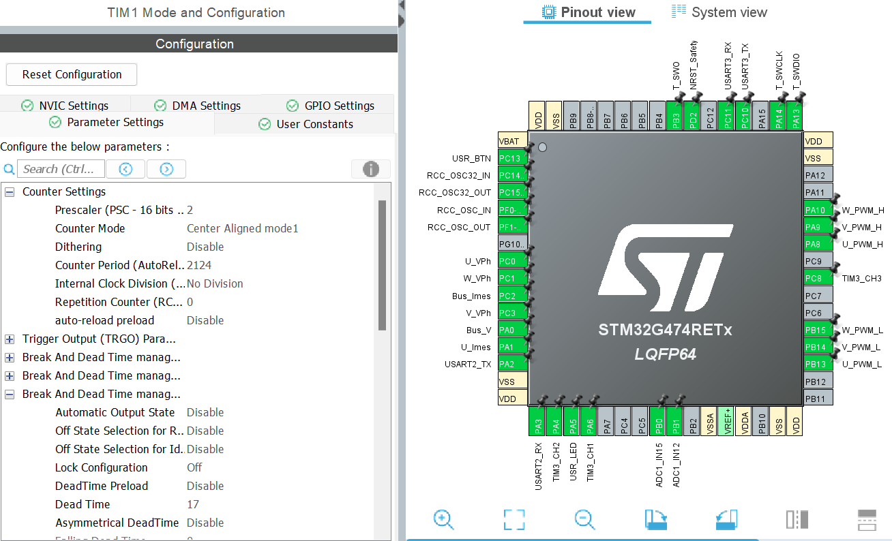

# TPActionneurESE

- # Compte Rendu : Contrôle de MCC avec la Carte Nucleo-G474RE

  ## Sommaire
  - [Introduction](#introduction)
  - [Objectifs](#objectifs)
  - [6.1 Génération de 4 PWM](#61-génération-de-4-pwm)
  - [6.2 Commande de Vitesse via UART](#62-commande-de-vitesse-via-uart)
  - [6.3 Premiers Tests de Contrôle du Moteur](#63-premiers-tests-de-contrôle-du-moteur)
  - [Conclusion](#conclusion)

  ---

  ## Introduction

  Ce document rend compte de la configuration et des tests d'un système de contrôle moteur en boucle ouverte utilisant une carte Nucleo-G474RE.

  ## Objectifs

  1. Générer des PWM pour le contrôle moteur.
  2. Implémenter une interface de commande de vitesse via UART.
  3. Valider le fonctionnement pratique du système.

  ---

  ## 6.1 Génération de 4 PWM

  **Paramètres configurés :**
  - **Fréquence** : 20 kHz
  - **Résolution** : 10 bits
  - **Temps mort** : 200 ns, validé par la datasheet des transistors (Rise Time + Turn on delay Time=90 ns).

  **Étapes effectuées :**
  - Configuration des pins pour les canaux PWM de TIM1.
  - Paramétrage des sorties complémentaires et des temps morts dans CubeIDE.

  

  f_PWM = 170,000,000 / (2 * 2 * (2124 + 1))

  

  f_PWM = 170,000,000 / 8500 = 20,000 Hz

  **Résultats :**
  - Signaux PWM observés et validés à l'oscilloscope (voir illustration ci-dessous).

  **Illustrations :**

  

  

  ---

  ## 6.2 Commande de Vitesse via UART

  **Commande implémentée :**
  - **Format** : `speed XXXX` pour ajuster la vitesse du moteur.

  **Étapes effectuées :**
  - Configuration de l’UART pour communication série avec terminal.
  - Détection et traitement de la commande `speed` via putty.
  - Application de la vitesse demandée par ajustement du rapport cyclique PWM.

  **Résultats :**
  - La commande de vitesse fonctionne, avec validation des valeurs limites (0 à 2174).

  **Illustrations :**

  - 

  ---

  ## 6.3 Premiers Tests de Contrôle du Moteur

  **Conditions de test :**
  - Rapports cycliques : 50 % et 70 %.
  - Ajout d'une montée progressive pour limiter les courants d'appel et les à-coups.

  **Observations :**
  - Démarrage progressif du moteur sans à-coups grâce à la rampe de montée.
  - Courants d'appel limités, améliorant la sécurité des transistors.

  **Illustrations :**
  - 
  - 

  ---

  ## Conclusion

  La configuration des PWM et de l'interface UART a permis de contrôler efficacement la vitesse du moteur en boucle ouverte. Les tests confirment le bon fonctionnement du système, avec un démarrage progressif permettant d’éviter les à-coups et les surintensités.

  

  